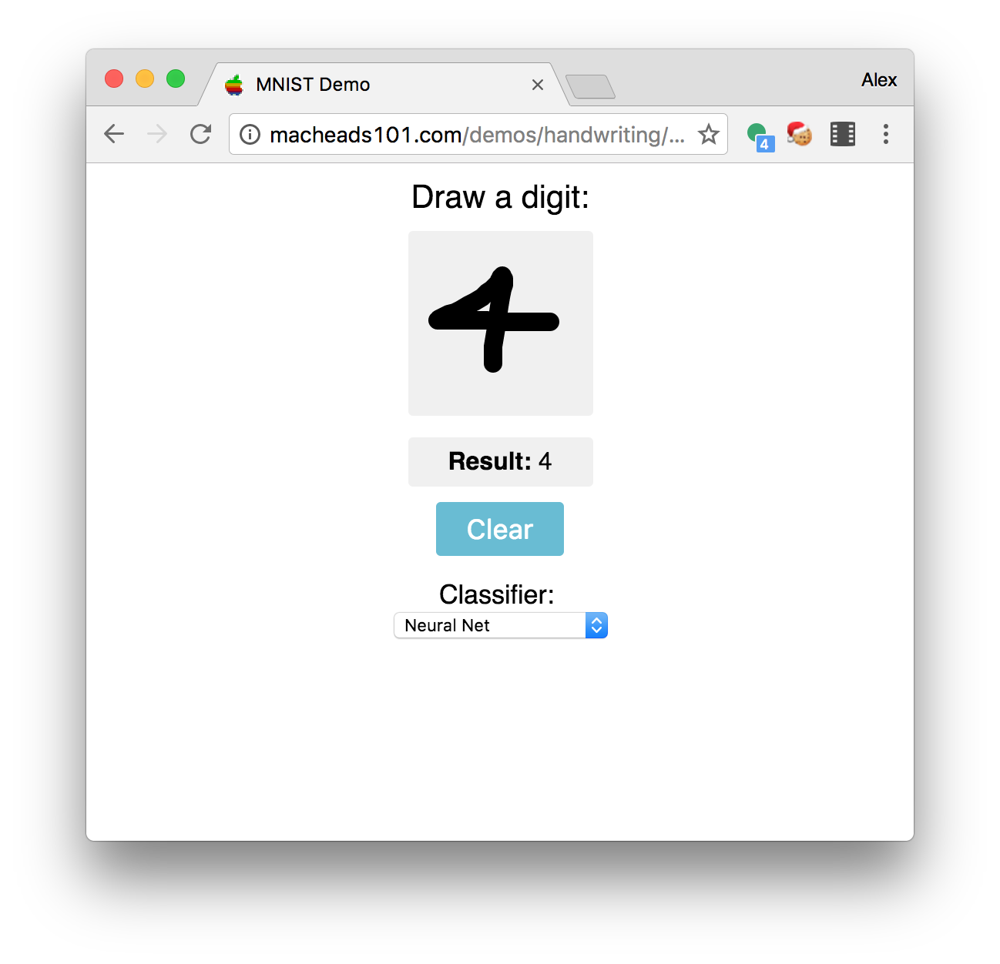

# mnist-demo

The purpose of this project is to manually test different classifiers on MNIST. My [mnist package](https://github.com/unixpickle/mnist) already facilitates the training and testing of classifiers on MNIST, but it is not interactive. This project serves to augment that package with interactive demos.

To quickly try this out, a [live demo is available here](http://macheads101.com/demos/handwriting/). Additionally, the [web](web) directory includes a pre-built copy of the demo, but it uses AJAX (which is not supported with the `file:///` URL scheme).

